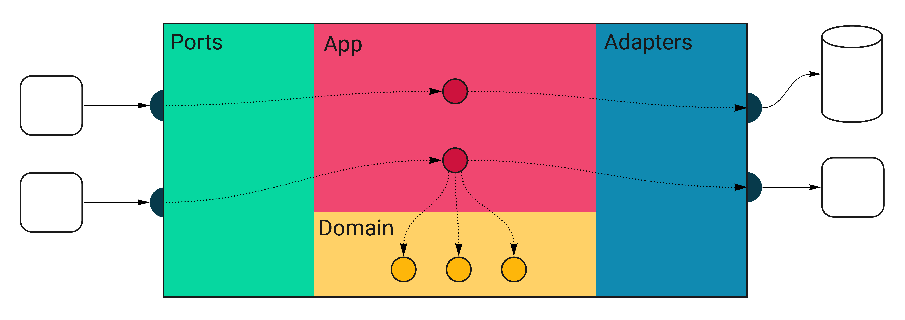

# Meisterwerk Catalog

## Overview

Meisterwerk Catalog is a Go-based application that provides a web API for managing product catalogs. It integrates with PostgreSQL for data storage, Redis for caching, and Prometheus for monitoring.

## Code structure

All external inputs hits the `ports` package. The only entry point to the application is through the `Ports layer`. `Ports` execute relevant handlers in the `App` layer. Some of these will call
the `Domain` code, and some will use `Adapters`, which are the only way out of the service. The `adapters` layer is where
your database queries and HTTP clients live.



## Prerequisites

- Docker
- Docker Compose
- Go 1.24

## Setup & Installation

1. **Clone the Repository:**

   ```bash
   git clone https://github.com/alvarezjulia/meisterwerk-catalog.git
   cd meisterwerk-catalog
   ```

2. **Build and Run with Docker Compose:**

   Ensure Docker and Docker Compose are installed and running on your system.

   ```bash
   docker-compose up
   ```

   This will start the dependencies (PostgreSQL, Redis, Prometheus).

3. **Run the program:**

   This program will run since there is already a `.env` file in the repository. For different environments, update accordingly.

   ```bash
   make run
   ```

4. **Run Migrations:**

   Migrations are automatically run during the startup process.

## Usage

The application exposes its API at `http://localhost:8080`. You can interact with the API using tools like `curl` or Postman.

## Endpoints

Refer to the `api/api.yml` file for information on the endpoints implemented in this service.

## Testing

To run the tests, use:

```bash
make test
```

## Monitoring

Prometheus is available at `http://localhost:9090` for monitoring application metrics.

## Configuration

Environment variables can be configured in the `docker-compose.yml` file:

- `DATABASE_URL`: URL for PostgreSQL database
- `REDIS_URL`: Redis connection URL

## Architecture Diagram

The architecture diagram for Meisterwerk Catalog can be found [here](https://drive.google.com/file/d/1Aci0ToiYuYzYITBxmVsgbFAS6zcj6knf/view?usp=sharing).

## License

This project is licensed under the MIT License.
